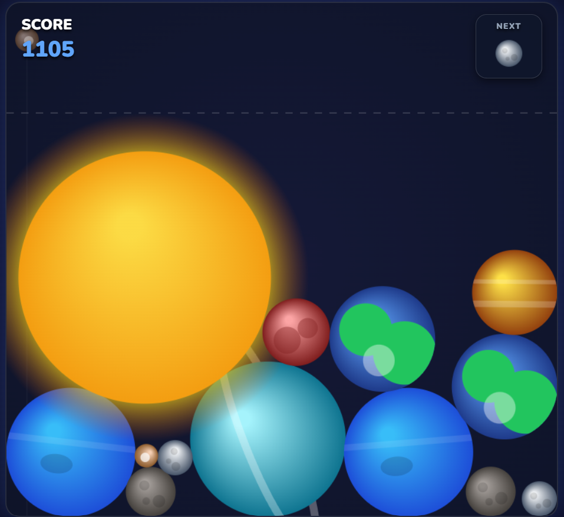
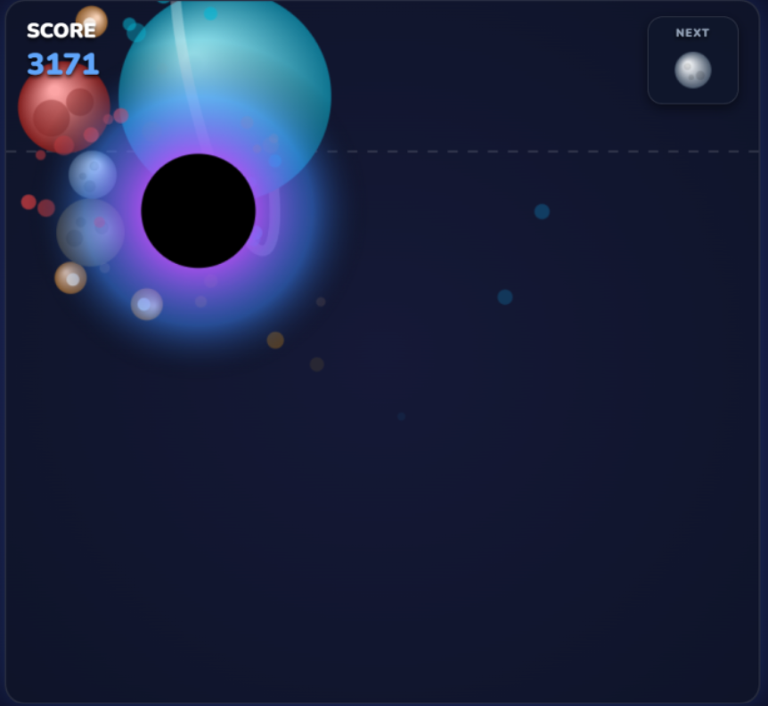

# Planet Drop

Planet Drop is a game based on Suika Game, at first I decided to make a card game but I recognized that for the time give it wouldn't be properly developed and it would not be very popular for it's complexity hence I focused on simplicity and gameplay satisfaction.

Like I said before it's a game based on Suika Game, but a Planet version. In this game you drop planets inside a container and once planets of the same type come in contact, they fuse together to become a bigger planet, everytime the player socre points by fusing planets with the biggest "planet", the Sun, being equivalente to the Watermelon in Suika Game. But Planet Drop has a unique feature. in which you can actually fuse together two Suns making a Black Hole appears, whereas in Suika Game you can't fuse two Watermelons.

The game being simple makes it easy to understand, satisfaction when planets fuse together and the quick replayability makes it even more appealing, also being based on Suika Game makes the game give somewhat of a nostalgic feeling.

